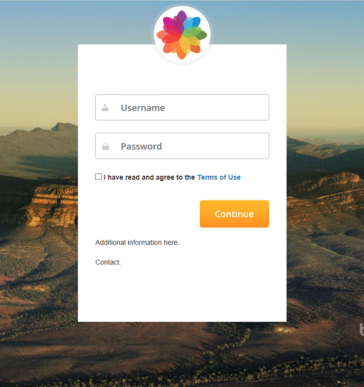

# pfSense responsive Hotspot Captive Portal

A responsive template for pfSense Captive Portal. Feel free to download and modify.



## Getting Started
Follow the instructions to get a copy of this project on your local machine.

### How do I get set up? 
The first step is to clone this repository
```
git clone https://github.com/rodrigoevildead/hotspot.git
```

After you download the project, you can change anything you want in the files according to your environment.

#### Main files:

Here are the files you'll probably want to change:

- `captiveportal-login-soft.js`: Here you can change the background images;
- `index.html`: Here you can modify some texts to suit your needs;
- `auth-error.html`: Same as ``index.html``;

## Installation

You can upload and install files by yourself or use the scripts (`prepare.sh` and `cp_install.sh`) available on this project.
If you choose to use the scripts, follow these instructions:

### Prepare file to install

Before install, you'll need to prepare the "package" by executing ``prepare.sh`` script

```
./prepare.sh
```

This script will compress all needed files to a tarball called `mycaptiveportal.tar.gz`

### Upload and Install additional files on pfSense using "Command Prompt"

On pfSense, open *"Diagnostics->Command Prompt"* and upload the files: `mycaptiveportal.tar.gz` `cp_install.sh`

On the same page, execute the following command:
```
/bin/sh /tmp/cp_install.sh
```

At this point, all additional files should be installed, so we only have to upload the HTML files directly into the Captive Portal settings.

### Uploading HTML Files

Open *"Services->Captive Portal->`captive portal name`->Configuration"* and upload the following files:

- `index.html`: This is the main HTML file, upload it to  **Portal page contents**
- `auth-error.html`: This is the **Auth error page content**

Now you can test your new Captive Portal Template!

## Important

Additional files will **NOT BE INCLUDED** in `config.xml`, so please be aware that *"Backup and Restore"* **WILL NOT** reinstall the files. Keep a copy ready to install again.

DISCLAIMER
----------
Please note: all tools/ scripts in this repo are released for use "AS IS" **without any warranties of any kind**,
including, but not limited to their installation, use, or performance.  We disclaim any and all warranties, either 
express or implied, including but not limited to any warranty of noninfringement, merchantability, and/ or fitness 
for a particular purpose.  We do not warrant that the technology will meet your requirements, that the operation 
thereof will be uninterrupted or error-free, or that any errors will be corrected.

Any use of these scripts and tools is **at your own risk**.  There is no guarantee that they have been through 
thorough testing in a comparable environment and we are not responsible for any damage or data loss incurred with 
their use.

You are responsible for reviewing and testing any scripts you run *thoroughly* before use in any non-testing 
environment.


**This is a fork of https://github.com/7security/hotspot**
